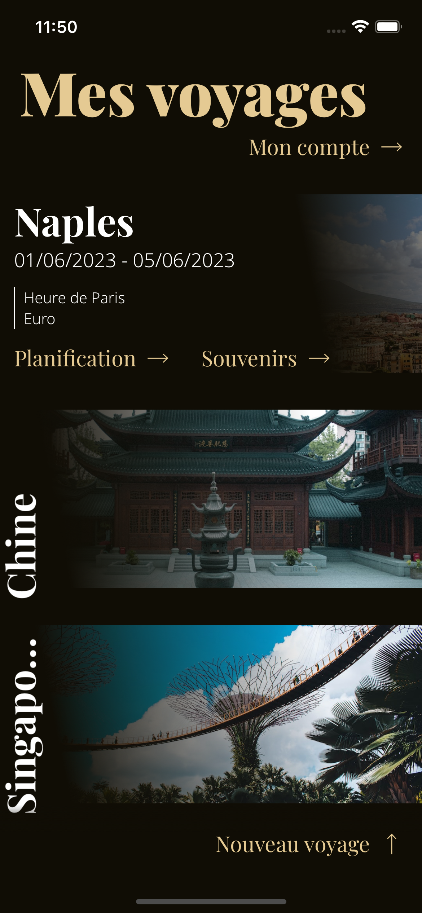
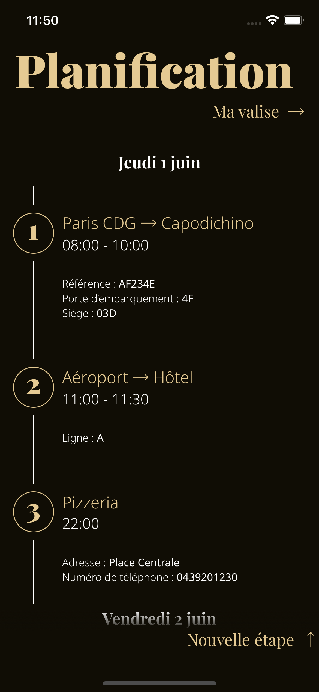
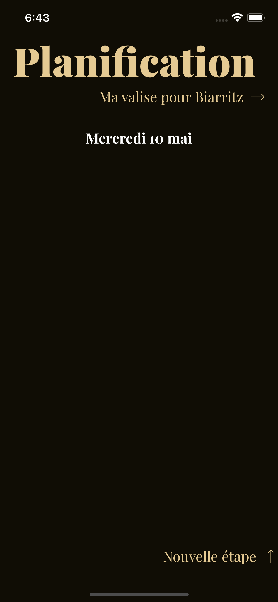

<!-- PROJECT LOGO -->
 

  

 

<!-- À PROPOS DU PROJET -->

## À propos du projet

Carnet De Voyage est une application mobile inspirée des carnets de voyage papier permettant de planifier son voyage et d'y associer des souvenirs.

 

  
  
  

 

<!-- FONCTIONNALITÉS -->

## Fonctionnalités

L'application permet de se créer un compte sur lequel on peut sauvegarder ses voyages.
Chaque voyage est divisé en deux parties :

- Planification

  - Transports
  - Hébergement
  - Visites
  - Choses à emporter

- Souvenirs

  - Photographies
  - Notes
  - Statistiques

L'application donne également des informations en fonction de la destination comme le fuseau horaire ou encore le taux de change et la devise.

<!-- CHOIX TECHNIQUES -->

## Choix techniques

- [![React Native][react_native.com]][react_native-url]
- [![Firebase][firebase.com]][firebase-url]
- [![Expo][expo.com]][expo-url]
- [![Axios][axios.com]][axios-url]
- [![Google Maps][google_maps.com]][google_maps-url]
- [![Unsplash][unsplash.com]][unsplash-url]

<!-- CIBLE -->

## Cible

Cette application s'adresse aux voyageurs en solo ou à plusieurs aimant être organisé et désirant garder une trace de leur séjour au même endroit.

<!-- MARKDOWN LINKS & IMAGES -->

[carnet_de_voyage-screenshot-1]: ./assets/screenshot-1.png
[carnet_de_voyage-screenshot-2]: ./assets/screenshot-2.png
[carnet_de_voyage-screenshot-3]: ./assets/screenshot-3.png
[react_native.com]: https://img.shields.io/badge/React_Native-282c34?style=for-the-badge&logo=react&logoColor=#61DAFB
[react_native-url]: https://reactnative.dev/
[firebase.com]: https://img.shields.io/badge/Firebase-039BE5?style=for-the-badge&logo=firebase&logoColor=FFCA28
[firebase-url]: https://firebase.google.com/
[expo.com]: https://img.shields.io/badge/Expo-000020?style=for-the-badge&logo=expo&logoColor=white
[expo-url]: https://expo.dev/
[axios.com]: https://img.shields.io/badge/Axios-5A29E4?style=for-the-badge&logo=axios&logoColor=white
[axios-url]: https://axios-http.com/
[unsplash.com]: https://img.shields.io/badge/Unsplash-000000?style=for-the-badge&logo=unsplash&logoColor=white
[unsplash-url]: https://unsplash.com/
[google_maps.com]: https://img.shields.io/badge/Google_Maps-4285F4?style=for-the-badge&logo=googlemaps&logoColor=white
[google_maps-url]: https://developers.google.com/maps?hl=fr
